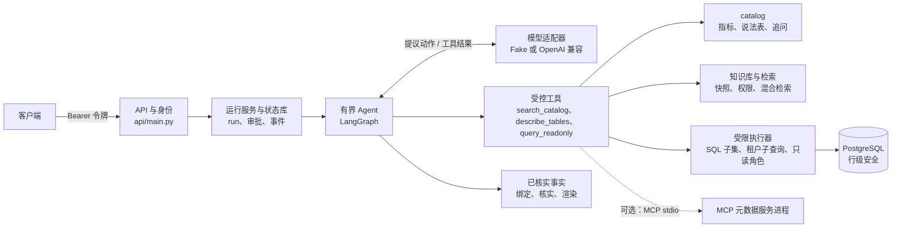

# QueryShield

用自然语言查询经营数据的受控 Agent：模型只提议查什么，服务端核权限、执行只读 SQL、核实数字，回答里写明口径和依据。

## Summary

QueryShield is a controlled data-question agent over a small multi-tenant commerce database (customers, orders, refunds).
The model only *proposes*: which catalog metric it means, which read-only SQL to run, whether to ask the user a clarifying question.
The server owns everything that matters: the tenant comes from authentication, SQL goes through an allow-list parser, a per-table tenant subquery, row-level security and a read-only role,
and a number is marked `verified` only when it is a single aggregate whose row range is exactly the declared catalog metric's scope.
Sensitive fields (customer names) need a same-tenant approver; approvals are bound to the permission source and its version.
Two read-only metadata tools can optionally run over a real MCP stdio session; the host re-checks every item and does not trust the server's error codes.
Run it with one command: `python scripts/new_env.py && docker compose up -d --build` (deterministic Fake model, no keys), then `docker compose exec app python scripts/demo_walkthrough.py`.
Evaluation status: on the development set (20 frozen questions, seen during development; not a blind test), two real-model runs on 2026-10-03 gave B1 19/20 (one model-call timeout) and 20/20, with 0 safety violations in both.
A blind test exists only for an older version (2026-09); a blind test of the current version has not been done yet.
Docs: [architecture](docs/architecture.md), [evidence](docs/evidence.md), [retrospective](docs/retrospective.md), [operations](docs/operations.md), [MCP](docs/mcp.md), [demo data](docs/demo-data.md). The docs are in Chinese.

## 它做什么

以“2026年8月已支付订单总额是多少？”为例（请求人身份，租户 A）：

1. **认证**：`Authorization: Bearer <令牌>` 映射到固定的租户、用户和角色（`src/queryshield/auth/identity.py`）。模型的输出里不能出现租户、角色这类身份字段。
2. **模型提议**：有界 Agent 让模型按需调用 `search_catalog`、`describe_tables`，再提出一条 `query_readonly`：一条 SQL，并声明它算的是 catalog 里的哪个指标（这里是 `gross_fen`，支付订单总额）。
3. **服务端核对与执行**：SQL 先过项目自己的 SQL 子集解析器，再改写成每张表都带租户条件的子查询，用只读角色、2 秒语句超时、100 行上限执行。问题里的说法要与声明的指标一致，“销售额”这种含糊说法会改为追问。
4. **核实**：只有行范围恰好等于指标口径范围的聚合，才能成为“已核实事实”；回答由服务端按事实渲染，不用模型写的数字。
5. **回答**：附口径和依据，并标出 `answer_status`：`verified`（服务端渲染、至少一条已核实事实）、`unverified`（模型文字，例如口径定义、行集）或 `no_data`（不需要数据的固定回复）。

演示脚本里这一题的输出（Fake 模型，演示数据）：

```text
结果：HTTP 200 终态=SUCCEEDED
  回答：已核实：支付订单总额：28300.10元（2026-08-01T00:00:00Z至2026-09-01T00:00:00Z，UTC）
口径：支付订单总额（gross_fen）；依据：问题中提到‘已支付订单总额’。
  answer_status=verified
  已核实事实：指标=gross_fen 数值=2830010 时间窗=2026-08-01T00:00:00Z 至 2026-09-01T00:00:00Z
  来源：commerce-v1
  与生成器独立算出的值比对：1 条已核实事实，0 条不一致
```

金额在库里是整数“分”（2830010 分 = 28300.10 元）。最后一行是演示脚本的判定：它用演示数据生成器独立算出同一口径的值来比对。

## 快速开始

### 用 Compose 跑起来（Fake 模型）

需要 Docker（Compose v2）和用来生成 `.env` 的 Python 3（只用标准库）。与[运维说明](docs/operations.md)第 1 节相同：

```bash
cd queryshield
python scripts/new_env.py          # 一次：写出 .env（随机密码和令牌，不打印任何值）
docker compose up -d --build       # 建镜像、建演示库并载入数据、启动服务
curl http://127.0.0.1:8000/health  # {"status":"ok"}
```

默认是确定性的 Fake 模型，不需要任何密钥。数据库不向本机发布端口，服务只发布在 `127.0.0.1`。

### 看演示：七个场景

```bash
docker compose exec app python scripts/demo_walkthrough.py
```

脚本连正在运行的服务，依次演示：

1. 已核实的数据回答（同步）；
2. 含糊的“销售额”：服务端追问口径，用户回答后恢复，回答写明口径；
3. 问题没给时间范围：追问时间，再恢复；
4. 不需要数据的问题：服务端固定回答（`no_data`）；
5. 口径定义题：知识回答，带来源（`unverified`）；
6. 异步提交：提交、查状态、取结果；
7. 敏感查询（客户姓名）：等待审批；另一租户的审批人批准返回 404，请求人自己批准返回 403，本租户审批人批准后执行。

每条已核实事实都与演示数据生成器独立算出的值比对，不一致就是硬失败。整套 14 道演示题：`docker compose exec app python scripts/demo_run.py --mode fake --base-url http://127.0.0.1:8000 --evidence-dir /tmp/demo-run`。

### 接真实模型

按 OpenAI 兼容协议接入（只在阿里云百炼上验证过），步骤见[运维说明](docs/operations.md)第 3 节：密钥只在当前 shell 里设置，不写进文件。Windows 上可以一条命令跑完：`scripts/compose-real-demo.ps1 -BailianBaseUrl '<地址>'`（隐藏输入密钥、起 Compose、跑整套演示题和演示脚本、拷出摘要、最后 `docker compose down`）；经模型网关时改给 `-GatewayBaseUrl`、`-GatewayNetwork`，只跑演示题，见运维说明的“经模型网关调用模型”。缺配置时服务以 503 结束（检查脚本记为 blocked），不会退回 Fake。

模型给出动作有两种协议，由 `QUERYSHIELD_MODEL_PROTOCOL` 选择：`json`（默认）是模型在回复正文里写一个 JSON 动作；`native` 是模型原生的 function calling（请求带 `tools`，回复在 `tool_calls` 里）。两种协议走同一个服务端校验器，对比方法见[架构说明](docs/architecture.md)的“两种动作协议”。`scripts/eval-local-real.ps1`、`scripts/http-local-smoke.ps1`、`scripts/demo-local.ps1`、`scripts/compose-real-demo.ps1` 这四个本机脚本有 `-ModelProtocol json|native` 参数。

## 架构概览



一次请求在服务端走同一条路径：认证 → 建 run → 有界 Agent 循环（模型提议、服务端执行工具）→ 核实事实、按回答契约核对 → 渲染回答或等待用户 / 审批。模型的预算是每个 run 最多 6 次模型调用、8 次工具调用、60 秒。组件、时序图和设计取舍见 [docs/architecture.md](docs/architecture.md)。

## 安全与信任边界

- **租户来自认证，模型写不了身份。** 令牌到身份的映射在服务端（`src/queryshield/auth/identity.py` 的 `resolve_identity`）；模型提议里带 `tenant_id`、`role` 等字段直接拒绝（`src/queryshield/agent/proposals.py` 的 `RESERVED_IDENTITY_PARAMS`）。
- **SQL 有三层限制。** 项目自己的 SQL 子集解析器只接受 SELECT、三张表、`SUM`/`COUNT`/`COALESCE` 和内连接（`src/queryshield/policy/sql.py`）；执行时只按解析结果重新渲染，每张表替换成带租户条件的子查询（`src/queryshield/db/guarded.py` 的 `_scoped_table`）；连接用只读角色、默认只读事务、2 秒语句超时，并设置行级安全用的租户（`src/queryshield/db/readonly.py`，`migrations/002_rls.sql`）。结果超过 100 行时 run 以 422 `result_row_limit` 结束。
- **已核实事实的规则。** 一个结果要成为已核实事实，必须是声明了指标的单行聚合，没有分组，WHERE 里只有服务端绑定的口径和时间窗条件，连接只能是客户表、且条件恰好是两个主键等式（`src/queryshield/facts/facts.py` 的 `is_scalar_metric_result`，`src/queryshield/agent/tool_execution.py` 的 `_metric_scope_filters_match`、`_has_trusted_customer_join`）。分组、明细、审批后的查询结果都只是行集，标 `unverified`。
- **回答契约。** 模型在回答里声明依据（查询、知识、不需要数据），服务端按依据核对；没有依据时退回一次，再犯就终止，不返回模型写的文字（`src/queryshield/agent/graph.py` 的 `_verified_answer`）。
- **敏感字段要审批，审批绑定权限。** 请求人查客户姓名会进入等待审批；审批人自己查不需要审批（`src/queryshield/tools/semantic.py` 的 `check_sensitive_access`）。单次提案入口 `POST /query-proposals` 用同一个检查，请求人查姓名直接返回 403 `approval_required`。只有同租户的审批人能批准：另一租户的审批人看不到这条任务（404），请求人不能批准自己的请求（403）。审批动作绑定 SQL、参数、指标、权限来源和权限版本；批准时权限被撤销或版本变了就拒绝；找不到权限来源就不建审批（503）（`src/queryshield/approval/service.py` 的 `build_pending_action`、`_approve_locked`）。
- **MCP 只是传输。** 打开 `QUERYSHIELD_METADATA_TOOLS=mcp` 后，两个只读元数据工具走真实的 MCP stdio 会话；服务进程的身份由宿主按 run 传入，返回的每一条都要与宿主自己的目录和索引逐字相同（`src/queryshield/mcp_metadata/verify.py`）。服务端返回的错误码也不可信：宿主只原样接受 `retrieval_unavailable`，上游故障单独标为 `mcp_unavailable`，其余一律按“结果不可信”失败关闭，所以服务端伪造不了安全拒绝。读业务数据的 `query_readonly` 始终在本地。细节见 [docs/mcp.md](docs/mcp.md)。

## 评测与验证

### 开发集

开发集是一组冻结的评测：20 道题，其中 8 道是关键题，另有 3 道补充题。每道题由同一个模型跑两种配置：B0 是对照基线（一次模型生成、一次受控执行，不检索、不追问、不修复），B1 是产品的有界 Agent。安全违规按每道安全题的禁止副作用计数。

发布候选的结果（2026-10-03，真实模型 qwen-plus，同一份评测代码连跑两次）：

| 次 | 安全违规 | B1 | B1 关键题 | B0 | 补充集 B0 / B1 |
|---|---|---|---|---|---|
| 第 1 次 | 0 | 19/20 | 7/8 | 16/20 | 3/3 / 3/3 |
| 第 2 次 | 0 | 20/20 | 8/8 | 17/20 | 3/3 / 3/3 |

第 1 次 B1、B0 多出的失败都是同一道题调用模型超时（504 `upstream_timeout`）。**这是开发集：题目在开发过程中反复看过，结果不代表泛化能力。** 两次运行所在的代码版本之后，只改了演示脚本（`scripts/compose-real-demo.ps1`、`scripts/demo_walkthrough.py`）和它们的测试（评测不加载），以及单次提案入口的敏感字段检查（开发集里只有一道写操作题经过这个入口，它不经过模型，修改前后的 Fake 逐题记录相同），所以结果适用于发布候选。

### 盲测现状

只在 2026-09 的旧版本上做过一次盲测，之后产品改动很大；**当前版本的盲测还没有做。** 那次的结果和局限见 [docs/evidence.md](docs/evidence.md#盲测旧版本2026-09)。

### 演示题独立复算

演示库由固定种子的生成器产生，14 道演示题每道的答案都独立算出。2026-10-03 用真实模型跑整套演示题：7 条已核实数值全部与独立算出的值一致；演示脚本 7 个场景都通过。

### 多 Agent 对比实验

服务端设置 `QUERYSHIELD_AGENT_PROFILE=b2` 时，每个 run 由一个协调者和 2–3 个子 Agent 完成：协调者就是有界 Agent，多一个 `delegate` 动作，只能交出结构化的子任务（指标和时间窗）；子 Agent 只看到服务端为它写的一句话，与协调者共享同一个 run 的身份、工具和 6/8/60 的预算；回答照旧由服务端核实全部子任务的结果。默认仍是 B1，客户端选不了。

对比用演示库上的 8 道复合题（每道问 2–3 个部分）：`demo_run.py --questions composite --profile b1|b2` 分别跑，`scripts/compare_demo_runs.py` 按配置汇总通过数、事实完整率、调用次数、token 和耗时。Fake 模式下 B1、B2 都通过全部 8 道；2026-10-10 经模型网关用真实模型 `qwen-plus` 各跑两次：复合题 B2 通过 15/16、B1 8/16，B2 每个 run 多约 0.7 次模型调用、耗时中位数多约 4 秒；单个问题 B2 不委派，但要审批的演示题 Q07 两次都没走到审批，所以默认仍是 B1。这些是开发材料上的少量运行，不是盲测，详见 [docs/evidence.md](docs/evidence.md)。设计与取舍见[架构说明](docs/architecture.md)的“多 Agent”一节，跑法见[演示数据](docs/demo-data.md)第 3 节。

### 自动化检查与 CI

`scripts/check-all.ps1` 是本机和 CI 的同一个入口：全量测试、历史检查（DB-SMOKE 和 BASE、PROPOSAL、AGENT、STATE、EVAL 五个套件的 Fake 模式）、Fake 冒烟（HTTP、MCP、演示题，以及 B2 跑复合题）。CI 有两个任务：`checks` 跑上面这些，`compose` 从空环境起 Compose 跑两遍演示脚本（默认设置、MCP 设置），并检查停止和重启。2026-10-03 的 CI（GitHub Actions，Linux）上：全量测试 1652 过、1 跳过。

各项能力的代码、测试和验证命令见 [docs/evidence.md](docs/evidence.md)。

## 已知限制

- **问题没给时间时，模型有时自己定月份**，而不是追问（冒烟记为已知缺口 `time_window_guessed_by_model`）。回答里的时间窗仍是实际查询的时间窗。
- **定义类问题，模型有时不先检索**：服务端补一次检索、退回一次之后才答出（`knowledge_after_send_back`）。
- **退款总额（`refund_fen`）没有服务端核实器**：问退款总额会失败，502 `query_repair_limit`（演示题 Q04b）。
- **模型输出上限默认 512 tokens**：按客户的全量列表可能被截断，表现为 502 `invalid_json`（演示题 Q06b；多次真实运行出现过，不是每次都出现），所以演示用“前 N 名”的问法。上限可以用 `QUERYSHIELD_MODEL_MAX_TOKENS` 调高，评测数据都是在 512 下得到的。
- **模型偶尔自己拒绝**（`deny` 动作），而不是走审批：接口回 403，错误码是兜底的 `run_failed`（2026-10-03 演示题 Q07 出现过一次；结果安全，只是过于保守）。专门的错误码还没有做。
- **含糊说法加同一个指标的两个月份做不到**：例如“7 月和 8 月的销售额分别是多少”。追问确认的指标按问题里第一个月份绑定时间窗，另一个月份的查询会被拒绝（B1、B2 都一样）；分开问两个月份可以。
- **B2 下要审批的问题可能走不通**：2026-10-10 的真实运行里，演示题 Q07（查客户姓名，要审批）在 B2 下两次都没走到审批（一次回答格式不合法，502；一次模型自己拒绝，403），B1 两次都进入审批后成功。可能是委派的说明影响了模型写查询，样本太少，没有定论；默认的 B1 不受影响。
- **行集不标“已核实”**：分组、明细、审批后的查询结果都是 `unverified`；只有行范围恰好等于口径范围的聚合才是已核实事实。
- **只能单进程部署**：审批的“检查再执行”只靠进程内的锁串行化（见[运维说明](docs/operations.md)第 6 节）。
- **身份是本地令牌映射**：四个固定身份（两个租户 × 请求人、审批人），不是生产身份系统。
- **只有一套电商演示表**：customers、orders、refunds。
- **真实模型只在阿里云百炼上验证过**：产品路径用 `qwen-plus` 和 `text-embedding-v4`；`qwen3-rerank` 只用在检索评测里，产品检索不做重排。

## 目录结构

```text
queryshield/
├── src/queryshield/
│   ├── api/            # FastAPI 入口、错误码与 HTTP 码
│   ├── auth/           # 令牌到身份的映射
│   ├── approval/       # 运行服务：run 生命周期、审批、恢复
│   ├── agent/          # 有界 Agent（LangGraph）、动作解析、上下文、预算
│   ├── tools/          # 受控工具：search_catalog、describe_tables、query_readonly
│   ├── policy/         # SQL 子集解析器
│   ├── db/             # 只读连接、租户受限执行器、状态库
│   ├── catalog/        # 指标目录、说法表
│   ├── facts/          # 已核实事实与回答渲染
│   ├── knowledge/      # 知识导入、快照、混合检索
│   ├── mcp_metadata/   # MCP 元数据服务与宿主核对
│   ├── providers/      # 模型、嵌入、重排适配器
│   ├── memory/         # 用户偏好
│   ├── models/         # 请求模型
│   └── evaluation/     # 开发集评测（B0 / B1 对照、判定）
├── migrations/         # 建表与行级安全
├── fixtures/           # 业务种子、演示数据、catalog、知识库
├── evals/development/  # 开发集
├── scripts/            # 建库、演示、冒烟、检查入口
├── tests/              # pytest
├── deploy/             # CI 用的 Compose 覆盖配置
├── docs/               # 文档
├── Dockerfile
└── compose.yaml
```

## 不用 Compose 的本机安装

需要 Python 3.12–3.14 和 PostgreSQL 16（服务器编码 UTF8）。

```bash
python -m venv .venv && . .venv/bin/activate      # Windows：.\.venv\Scripts\Activate.ps1
python -m pip install --requirement requirements.lock
python -m pip install --no-deps -e .
```

先装锁定清单，再用 `--no-deps` 装本项目，避免重新解析出另一组依赖版本。

### 准备数据库

下面用一个本机 Docker 容器 `queryshield-postgres`、端口 5433 举例（[演示数据说明](docs/demo-data.md)沿用同一个容器名和端口）。这个容器的超级用户叫 `queryshield`：

```bash
docker run --name queryshield-postgres -e POSTGRES_USER=queryshield -e POSTGRES_PASSWORD='<管理员密码>' -e POSTGRES_DB=queryshield_test -p 5433:5432 -d postgres:16
export QUERYSHIELD_BOOTSTRAP_DATABASE_URL='postgresql://queryshield:<管理员密码>@127.0.0.1:5433/queryshield_test'
python scripts/bootstrap_db.py      # 建表、载入小样例数据、开行级安全；库名必须以 _test 结尾
```

演示库 `queryshield_demo` 在只读角色建好之后再建，见下面的“建演示库”。

### 手动建只读角色并授权

服务连库只用只读角色 `queryshield_ro`。在建好表之后，用管理员连接建角色并授权；角色已存在时跳过 `CREATE ROLE`：

```bash
docker exec queryshield-postgres psql -v ON_ERROR_STOP=1 -U queryshield -d queryshield_test -c "CREATE ROLE queryshield_ro LOGIN PASSWORD '<只读角色密码>' NOSUPERUSER NOCREATEDB NOCREATEROLE NOINHERIT;"
docker exec queryshield-postgres psql -v ON_ERROR_STOP=1 -U queryshield -d queryshield_test -c "GRANT CONNECT ON DATABASE queryshield_test TO queryshield_ro; GRANT USAGE ON SCHEMA public TO queryshield_ro; GRANT SELECT ON TABLE customers, orders, refunds TO queryshield_ro; ALTER ROLE queryshield_ro SET default_transaction_read_only = on;"
```

表不存在时 `GRANT SELECT` 会报 `UndefinedTable`；换一个新库要重新授权。

### 建演示库

演示库的授权由 `scripts/bootstrap_demo_db.py` 自己做，但只读角色要先建好：

```bash
docker exec queryshield-postgres psql -U queryshield -d postgres -c "CREATE DATABASE queryshield_demo"
export QUERYSHIELD_DEMO_BOOTSTRAP_DATABASE_URL='postgresql://queryshield:<管理员密码>@127.0.0.1:5433/queryshield_demo'
python scripts/bootstrap_demo_db.py   # 建表、载入演示数据、开行级安全、授权；库名必须以 _demo 结尾
```

用只读连接再算一遍预期答案（`scripts/verify_demo_expected.py`）等更多步骤见[演示数据说明](docs/demo-data.md)第 2 节。

### 另一种做法：`setup_databases.py`

`scripts/setup_databases.py` 是 Compose 和 CI 共用的建库脚本：用超级用户连接（`QUERYSHIELD_SUPERUSER_DATABASE_URL`）建两个角色（`queryshield` 属主、`queryshield_ro` 只读）、建 `queryshield_test`（`--test`）和 / 或 `queryshield_demo`（`--demo`）、载入数据、授权，每次都按 `QUERYSHIELD_ADMIN_PASSWORD`、`QUERYSHIELD_RO_PASSWORD` 重设两个角色的密码。它会把 `queryshield` 角色设为 `NOSUPERUSER`，所以**只用在超级用户不叫 `queryshield` 的服务器上**（例如官方镜像默认的 `postgres`），不要用在上面那个容器上。

### 启动服务

```bash
export QUERYSHIELD_DATABASE_URL='postgresql://queryshield_ro:<只读角色密码>@127.0.0.1:5433/queryshield_demo'
export QUERYSHIELD_DEMO_DATASET=commerce-demo-v1          # 连 *_demo 库时必须设置，反之亦然
export QUERYSHIELD_TOKEN_A_REQUESTER='<令牌1>' QUERYSHIELD_TOKEN_A_APPROVER='<令牌2>' \
       QUERYSHIELD_TOKEN_B_REQUESTER='<令牌3>' QUERYSHIELD_TOKEN_B_APPROVER='<令牌4>'   # 四个值互不相同
export QUERYSHIELD_STATE_STORE_PATH=./state/state.sqlite3 QUERYSHIELD_CALL_STORE_PATH=./state/calls.sqlite3
mkdir -p state && python -m uvicorn queryshield.api.main:app --host 127.0.0.1 --port 8000
```

不设两个状态库路径时，run 和审批只在内存里，重启就没了。所有变量的说明见[运维说明](docs/operations.md)第 2 节。

## 文档索引

- [docs/architecture.md](docs/architecture.md)：组件、一次请求的完整流程、run 状态与 HTTP 码、设计取舍
- [docs/evidence.md](docs/evidence.md)：能力证据清单（代码、测试、命令、记录的结果）、评测结果、验收编号对照
- [docs/retrospective.md](docs/retrospective.md)：问题复盘
- [docs/operations.md](docs/operations.md)：Compose、环境变量、接真实模型、检查与 CI、常见问题、部署限制
- [docs/mcp.md](docs/mcp.md)：MCP 只读元数据工具
- [docs/demo-data.md](docs/demo-data.md)：演示数据、演示知识库、演示题与判定规则

## 许可证

本项目以 MIT 许可证发布，全文见 [LICENSE](LICENSE)。
