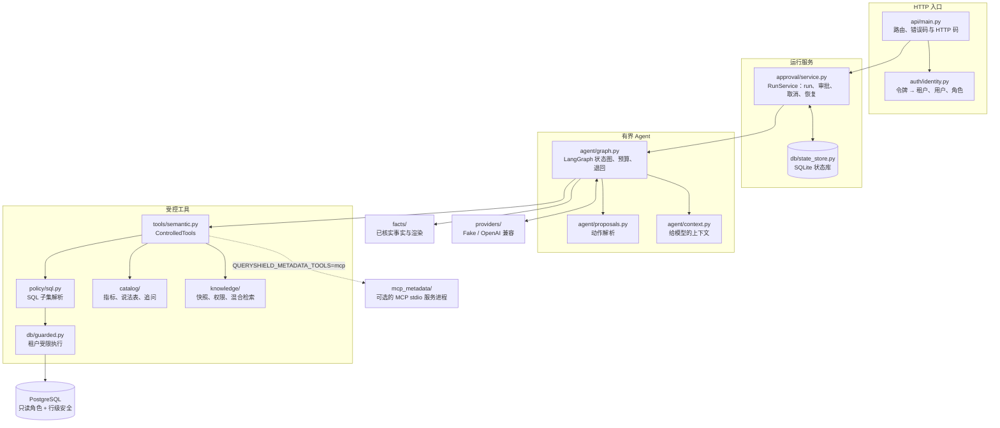
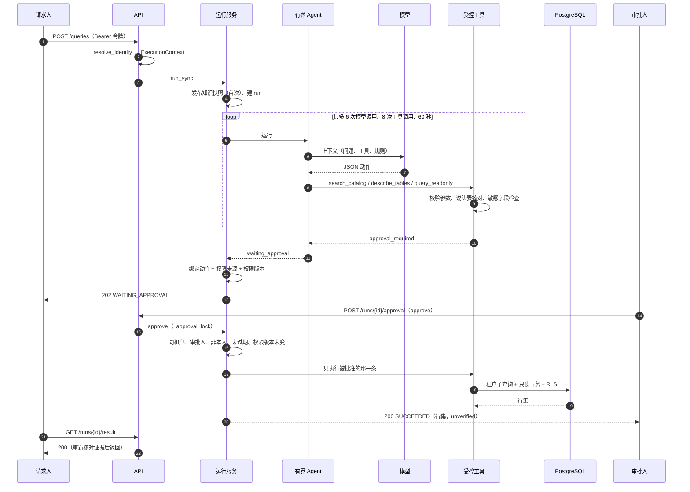

# 架构说明

QueryShield 把“理解问题”交给模型，把“谁能看什么、执行什么、哪个数可信”留在服务端。本文按组件说明代码在哪里、各自守什么边界，再给出一次请求的完整流程和主要的设计取舍。代码位置都相对于本目录；写的是符号名，行号会随代码变化。

## 总览

## 组件

### API 与身份

HTTP 接口都在 `src/queryshield/api/main.py`：

| 方法与路径 | 作用 |
|---|---|
| `POST /queries` | 提交问题。默认同步返回；带 `Prefer: respond-async` 时返回 202 和 `Location: /runs/{id}` |
| `POST /query-proposals` | 单次提案入口：客户端直接提交一条 `query_readonly` 提议，不经过模型。服务端照样核身份、SQL 子集、租户和敏感字段；请求人查客户姓名返回 403 `approval_required`，审批人照常执行 |
| `GET /runs/{id}`、`GET /runs/{id}/result` | 查状态、取结果。取结果时服务端重新核对存下的结果证据和事实，不通过返回 502 `evidence_validation_failed` |
| `POST /runs/{id}/resume` | 回答追问后继续，只在 `WAITING_USER` 时可用，否则 409 `invalid_run_state` |
| `POST /runs/{id}/approval` | 审批人批准或拒绝 |
| `POST /runs/{id}/cancel` | 取消 |
| `GET /runs/{id}/events` | 事件流（SSE） |
| `GET`/`PUT`/`DELETE /preferences/{key}` | 用户偏好 |
| `GET /health` | 健康检查 |

**run 的公开字段。** 返回 run 的响应（同步 `POST /queries`、`GET /runs/{id}`、`GET /runs/{id}/result`、resume、审批、取消）都经 `src/queryshield/api/main.py` 的 `_public_run`，带上 run 编号、状态、租户、请求人、调用次数等字段。其中有两个用量字段，不要混用：

- `usage_total`：这个 run 的聊天调用用量合计，所有返回 run 的响应都有，形如 `{"status": "known", "prompt_tokens": 1234, "completion_tokens": 56, "total_tokens": 1290}`。`known`：每次聊天调用都报了用量，三个数是合计；`unknown`：至少一次聊天调用没有用量（例如 Fake 模型）、存下的合计对不上、run 还没存下用量，或者 run 执行中途抛异常结束时有一次已经发出的聊天调用没来得及记下，三个数都是 `null`，不按 0 算；`not_run`：这个 run 没有聊天调用，三个数都是 0。口径和 `model_call_count` 一样只算聊天调用，嵌入不算；追问后恢复的 run 是暂停前和恢复后的合计，审批后执行不调模型，合计不变。执行中途抛异常结束的 run，计数和合计按最后一个已写进事件表的步骤算，出错前已记下的调用都在里面；第一次调模型之前就出错的 run（B0 也一样）是 `not_run`。合计只在 run 停下时更新：执行期间（`RUNNING`、`CANCEL_REQUESTED`）一律是 `unknown`，包括追问后恢复和审批后执行，即使暂停时已经存下了合计；提交后才是新的合计。
- `usage`：只有同步 `POST /queries` 的响应有，是逐次聊天调用的明细列表（调用编号、上游的调用编号和请求编号、三个用量、`usage_status`）。

身份：`src/queryshield/auth/identity.py` 的 `resolve_identity` 把 `Authorization: Bearer <令牌>` 映射到四个固定身份之一（租户 A、B 各一个请求人、一个审批人），令牌来自环境变量；有两个令牌相同时整张映射作废。服务端用认证结果构造 `ExecutionContext`，之后所有工具调用都用它。用哪种配置（B1 有界 Agent 或 B0 基线）由服务端设置 `QUERYSHIELD_AGENT_PROFILE` 决定，客户端选不了。

### 运行服务与状态库

`src/queryshield/approval/service.py` 的 `RunService` 管理 run 的生命周期：同步执行（`run_sync`）、异步执行（`start_async`，后台线程）、追问后继续（`resume_waiting_user`）、审批（`approve`）、取消（`cancel`）、按身份读取（`visible_run`）。状态存在 `src/queryshield/db/state_store.py` 的 `StateStore`（SQLite），表有 runs、approvals、events、preferences、knowledge_snapshots、knowledge_acl、parallel_groups、parallel_branches 等。

- **可见性。** run 只对同租户的发起人可见；同租户的审批人只在 `WAITING_APPROVAL` 时能看到去掉结果的版本，批准之后执行期间（`RUNNING`）和结束后都是 404，结果看审批请求自己的响应。其他人一律 404。
- **审批。** 进入审批时，`build_pending_action` 把要执行的动作（SQL、参数、指标、时间窗、租户、请求人、SQL 策略版本、catalog 版本）连同权限来源 id 和权限版本一起存下，并记动作的哈希。`approve` 在 `_approval_lock` 里完成“检查再执行”：同租户、审批人角色、不是请求人本人、没过期（10 分钟）、权限来源仍然有效且版本不变，然后只执行被批准的那一条。找不到有效的权限来源时，`_approval_permission` 让这次查询以 503 `approval_permission_unavailable` 结束，不建审批。
- **恢复和审批后执行。** 追问后恢复（`resume_waiting_user`）在各项检查通过后，把 run 从 `WAITING_USER` 改成 `RUNNING`；审批后执行在消费审批、再核绑定的动作之后、执行 SQL 之前，把 run 从 `WAITING_APPROVAL` 改成 `RUNNING`。之后和首次执行一样：执行期间是 `RUNNING`，每个出口都落到终态或回到等待状态，只写一条终止事件。不写单独的“开始”事件，恢复后的步骤照样随执行写入、推到事件流。被拒绝的恢复（检查点无效、答案无效等）和审批（审批人不对、过期、权限变了、绑定的动作变了）不改状态：图在还原检查点时拒绝、这次执行一个步骤都还没写时，run 改回 `WAITING_USER`；已经写了步骤之后才出错（例如保存新的等待检查点失败），按出错结束（`FAILED`），不能再恢复，否则下次恢复会把这些步骤再写一遍。恢复的提交本身出错也按出错结束，和首次执行一样（例如 502 `evidence_validation_failed`）。暂停前已经成功的查询结果，恢复后照样能被回答引用和核对：暂停时它们的证据随服务端检查点存下，恢复时逐条核对属于这个 run、这个租户和请求人，再放回这次执行的工具；存下的记录格式不对或不属于这个 run，恢复返回 409 `checkpoint_invalid`，run 留在 `WAITING_USER`。
- **有条件的状态转移。** 把 run 移出等待状态、`RUNNING` 或 `CANCEL_REQUESTED` 的写入（开始恢复、开始审批后执行、取消、拒绝审批，以及执行方结束一次执行时的写入：提交结果、再次追问、停下来等审批、审批后执行成功、出错结束）都用 `StateStore.transition_run`：只有当前状态是指定的那个才改，要写的事件、状态（以及要写的计数、结果和审批记录）在同一个事务里，先写事件。执行方结束时 run 已经不是 `RUNNING`，说明期间被请求取消，就从 `CANCEL_REQUESTED` 改成 `CANCELLED`（同样有条件），不建审批记录，计数和用量按这次执行算。所以取消和开始、取消和结束、取消和拒绝无论谁先到，都只有一条终止事件、排在最后：
  - 取消先到：恢复不调模型，审批后执行不跑 SQL（审批已经消费，记录是 `APPROVED`，run 是 `CANCELLED`；再批一次只回放 `CANCELLED`）；拒绝不再改状态。
  - 开始先到：取消改走“请求取消”（202 `CANCEL_REQUESTED`），执行停下后落 `CANCELLED`。
  - 执行先结束：取消不写任何东西，返回结束时的 run。
  - 取消先于执行方的最终写入到达（哪怕已经过了提交开头的检查）：取消返回 202，run 以 `CANCELLED` 结束，`CANCEL_REQUESTED` 的事件在终止事件前面。
  - 执行先停下来等待（恢复后又追问一次，首次执行停在等审批）：按等待中的 run 取消（200 `CANCELLED`，一条终止事件）。
  - 取消的写入没成功（读和写之间状态变了），就按 run 现在的状态重新判断一次。
  - 拒绝先到：取消不写任何东西，返回 `DENIED`。
- **容量与取消。** 同时活跃的 run 最多 2 个（`MAX_ACTIVE_RUNS`），只算首次执行；追问后恢复和审批后执行不算在内，它们各由一把服务级的锁串行，同一时刻最多各一个。取消运行中的 run（首次执行、恢复、审批后执行）只记“请求取消”，等执行真正退出后再落终态；等待中的 run 直接变成 `CANCELLED`。提交开头检查一次取消（取消了就不必再算结果），但以最终写入为准：只要取消在最终写入之前到达（返回了 202），run 就以 `CANCELLED` 结束；结果本来是等待（追问、等审批）时也一样，不建审批记录。恢复和审批后执行开始时清掉取消标记，从干净的状态开始。进程在执行中退出会留下 `RUNNING`，启动时不扫描；恢复和审批后执行也一样。
- **步骤随执行写入。** 有界 Agent 用 LangGraph 的 `stream` 跑图，每个节点完成后，运行服务把这一步新产生的事件写进事件表（类型 `agent_step`，payload 是整个事件），每条只写一次；提交时只写还没写的（不经过图的结果，例如点名外租户的拒绝）。事件表里的顺序是 `accepted`、`step_started`、各步骤、（MCP 设置下的 `metadata_session`）、`waiting` 或终止事件。执行中途抛异常时，已写入的步骤留在表里，计数和用量取最后一个已写完的步骤的 Agent 状态；运行服务给模型包一层计数，这次执行调模型的次数多于写进去的 `model_call` 条数时（调用发出了，但它所在的节点没完成），用量记 `unknown`。
- **事件流（SSE）。** `GET /runs/{id}/events` 推事件表里的事件，每帧 `id`、`event` 和一行 `data`：`event_id`、`run_id`、`type`、`status`、`occurred_at`，有结果时加 `result_id`。`agent_step` 帧另带 `step`，只从事件里挑这些字段（有才带）：`kind`、`status`、`error_code`、`tool_name`、`elapsed_ms`（工具调用的耗时）、`model`、`usage_status`、`prompt_tokens`、`completion_tokens`、`total_tokens`；不带模型原文、提示词、SQL、参数、检索词、行数据和各种编号、哈希、版本。模型调用的事件没有耗时字段，耗时可以看相邻帧的 `occurred_at`。其它类型的帧不带 `step`。同租户的审批人在 `WAITING_APPROVAL` 时也能连这个流，看到的是同样的摘要。
- **恢复。** 应用启动时，`recover_parallel_groups` 扫描状态库里的并行分支组：全部已提交的复用结果，状态不确定的标 `FAILED/recovery_required`，不重跑 SQL（`src/queryshield/agent/parallel_durable.py` 的 `recover_on_startup`）。

### 有界 Agent

`src/queryshield/agent/graph.py` 的 `BoundedAgent` 用 LangGraph 的 `StateGraph`，四个节点：`model_decision`、`execute_tool`、`execute_parallel`、`finish`。模型每一步输出一个 JSON 动作（`src/queryshield/agent/proposals.py`），类型只有 `tool_call`、`parallel_readonly`、`ask_user`、`final_answer`、`deny`；工具只有 `search_catalog`、`describe_tables`、`query_readonly`。

- **预算**（`src/queryshield/agent/runtime.py` 的 `build_b1_agent`，产品和评测共用这一个装配函数）：每个 run 最多 6 次模型调用、8 次工具调用、60 秒。另有三种各 1 次的机会，互不占用：SQL 修复（`MAX_QUERY_REPAIRS`）、追问退回（`MAX_CLARIFICATION_BOUNCES`）、回答退回（`MAX_ANSWER_BOUNCES`）。
- **修复与退回。** 可修复的 SQL 错误（例如语法不在子集里、参数个数不对、没声明指标）给模型一次修复机会，用完以 502 `query_repair_limit` 结束；安全类拒绝直接以 DENIED 结束，不给修复。追问和回答的核对见下面的 catalog 和已核实事实两节。
- **并行。** 动作类型里有 `parallel_readonly`（2–3 个指标的只读并行），但只在服务端给了并行计划和调度器时可用。产品的 B1 装配不带调度器，所以 HTTP 路径上没有并行分支；并行调度和它的崩溃恢复由历史检查覆盖（`src/queryshield/agent/parallel.py`、`src/queryshield/agent/parallel_durable.py`）。

### 工具与受限执行器

`src/queryshield/tools/semantic.py` 的 `ControlledTools` 是模型能碰到的全部工具。工具参数里不能带身份字段，身份只来自 `ExecutionContext`。

- `query_readonly` 是唯一读业务数据的工具。SQL 先过 `src/queryshield/policy/sql.py` 的 `parse_readonly_select`：项目自己的分词器和解析器，只接受单条 SELECT，表只能是 customers、orders、refunds，函数只有 `SUM`、`COUNT`、`COALESCE`，只支持内连接，不接受 CTE、集合运算、注释和类型转换，长度不超过 4000 字符。
- 执行在 `src/queryshield/db/guarded.py`：只按解析结果重新渲染 SQL，每张表替换成 `(SELECT * FROM t WHERE tenant_id = %s)` 子查询（`_scoped_table`），没有 LIMIT 时补 `LIMIT 101`，多于 100 行以 422 `result_row_limit` 结束。连接来自 `src/queryshield/db/readonly.py` 的 `connect_readonly`：只读角色、`default_transaction_read_only=on`、`statement_timeout=2000`，并在事务里设置 `queryshield.tenant_id`，配合 `migrations/002_rls.sql` 里三张表的行级安全（ENABLE + FORCE）。
- 查客户姓名（`customers.name` 或 `customers.*`）时，非审批人会得到 `approval_required`，run 进入等待审批（`check_sensitive_access`）。单次提案入口 `POST /query-proposals` 用同一个检查，请求人查姓名直接返回 403。

### catalog：指标、说法表、追问

`src/queryshield/catalog/catalog.py` 读 `fixtures/semantic/catalog-v4.json`。四个指标：`paid_count`（已支付订单数）、`gross_fen`（支付订单总额）、`refund_fen`（退款总额）、`net_fen`（退款后净额），金额单位是分。三条追问规则：口径（“销售额”“营收”等在总额与净额之间含糊）、订单范围、退款窗口。

`src/queryshield/catalog/phrases.py` 的 `PhraseIndex` 是说法表：每个指标的明确说法、每条追问规则的含糊说法，按最长匹配、不重叠扫描。说法表**只用来核对**，不替模型选指标：

- 问题里只有含糊说法，模型却直接声明了口径：不执行 SQL，改为用 catalog 里的固定问题追问；
- 问题里已有明确说法，模型却追问：退回一次，让它直接查；
- 模型声明的指标与问题里的明确说法矛盾：在执行 SQL 之前拒绝。

核对的入口是 `src/queryshield/agent/tool_execution.py` 的 `check_clarification`。

### 已核实事实

“已核实”是服务端给的标签，规则写在一处、五个地方共用（B1 图、B0、审批前存下的结果、批准后的执行、事实解析）：

- 结果必须有指标绑定、恰好一行、不分组（`src/queryshield/facts/facts.py` 的 `is_scalar_metric_result`）；
- WHERE 里只能是服务端绑定的条件：支付状态、时间窗的两端、租户（`src/queryshield/agent/tool_execution.py` 的 `_metric_scope_filters_match`；`net_fen` 是服务端的两段计划，单独核对）；
- 只能连客户表，ON 恰好是 `tenant_id`、`customer_id` 两个等式，即客户表的主键（`_has_trusted_customer_join`）。

已核实的回答整段由 `src/queryshield/facts/render.py` 的 `render_verified_answer` 渲染：“已核实：指标：值（时间窗，时区）”，再加一句口径和依据；不用模型写的文字和数字。

回答契约：模型在 `final_answer` 里声明依据 `basis`（`query` 默认、`knowledge`、`no_data`），服务端在 `_verified_answer` 里按依据核对。`query` 要求本 run 有成功的查询；`knowledge` 只认本 run 的检索来源，来源 id 由服务端给出；`no_data` 的回复由服务端用固定文字写。没有依据时退回一次，再犯就终止；模型声明 `knowledge` 却没有检索时，服务端用原问题检索一次再退回。响应里的 `answer_status` 是 `verified`（服务端渲染且至少一条事实）、`unverified`（模型文字，例如口径定义、行集）或 `no_data`。

### 知识库与检索

`src/queryshield/knowledge/`：

- **导入与快照**（`ingest.py`）：按来源登记表导入文档，切块（每块最多 800 字、重叠 100 字），快照 id 是版本加内容清单哈希的前 16 位，内容不变 id 就不变。
- **权限**（`retrieval.py`）：来源必须是 active、角色在允许列表里、租户范围是全局或本租户；catalog 里要审批的条目对非审批人不可见。
- **混合检索**（`retrieval.py` 的 `HybridRetriever`）：关键词路（词频加同义词扩展）和向量路（余弦相似度，下限 0.60）各取最多 10 个候选，用 RRF（k=60）融合。支持可选的重排，产品路径不启用。
- **快照发布**：产品服务在第一次运行前把实际使用的快照和权限表写进状态库，同一个快照 id 只发布一次；权限变化时版本号加 1，等待中的审批据此失效（`RunService.product_knowledge`）。

### MCP 元数据工具

服务端设置 `QUERYSHIELD_METADATA_TOOLS=mcp` 时，`search_catalog`、`describe_tables` 改走官方 SDK 的 MCP stdio 会话，一个 run 一个服务进程（`src/queryshield/mcp_metadata/`）。宿主按 run 的身份生成启动参数，发送前用本地同一组函数校验参数，收到后逐条核对（`verify.py`），交给 Agent 的是宿主按自己的记录重建的数据；错误码只原样接受 `retrieval_unavailable`，其余按固定规则映射。任何失败都关闭会话，不退回本地工具。`query_readonly` 始终在本地。详见 [MCP 只读元数据工具](mcp.md)。

### 模型适配器

`src/queryshield/providers/`：`QUERYSHIELD_PROVIDER_MODE` 为 `fake`（默认）时用确定性的 `FakeModel`，为 `real` 时用 OpenAI 兼容的 `OpenAICompatibleModel`（`/chat/completions`，超时默认 15 秒，输出上限默认 512 tokens）。缺配置以 503 结束，不退回 Fake。用量只记提供方返回的值：没有就记 `unknown`，不补 0；Fake 的用量一律是 `unknown`。另有嵌入（`embedding.py`）和重排（`rerank.py`）适配器。聊天和嵌入共用 `http.py`：run 里的调用带请求头 `X-Run-Id`（run 编号），出错时用同一个函数读提供方的错误码，网关的 429 `quota_exhausted`、`rate_limited` 映射成 `model_quota_exhausted`、`model_rate_limited`；调用记录的模型名取响应里的 `model`。

### 两种动作协议

`QUERYSHIELD_MODEL_PROTOCOL` 选择模型怎样给出决定，只对 B1 生效（B0 是对照基线，始终用 json）：

- **json**（默认）：模型在回复正文里写一个 JSON 动作，`src/queryshield/agent/proposals.py` 的 `parse_query_proposal` 严格解析。
- **native**：请求带六个函数（`src/queryshield/agent/context.py` 的 `native_tools`：`search_catalog`、`describe_tables`、`query_readonly`、`ask_user`、`final_answer`、`deny`），`tool_choice` 为 `auto`，`parallel_tool_calls` 为 false。回复里的那一个调用由 `src/queryshield/agent/proposals.py` 的 `native_action_text` 转成它代表的 JSON 动作，再交给同一个 `parse_query_proposal`。没有调用、多个调用都直接结束 run，不额外修复。
- 函数的参数 Schema 取自校验器用的同一组常量，只是给模型的提示；服务端的校验器仍是唯一的判断。原生模式的系统消息保留全部语义规则，只去掉被 Schema 取代的线上格式。
- 原生模式有自己的四个版本号（提示词、动作 schema、工具描述、适配器），记在事件和 checkpoint 里。一个 run 始终按开始时的协议继续；协议不同的 checkpoint 不能交给另一种协议的 Agent 恢复。
- 事件只记函数名（不在提供列表里的记 `<other>`）、arguments 的长度和 sha256、`finish_reason`，不记原文。

### 评测

`src/queryshield/evaluation/` 用同一个模型、同一组受控工具、同一个身份，成对运行两种配置：

- **B0**（`run_b0_single_pass`）：一次模型生成、一次受控执行，不检索、不追问、不修复，作对照基线；
- **B1**（`build_b1_agent`）：产品的有界 Agent。

题目在 `evals/development/`：冻结的 20 道题（其中 8 道关键题，`state_cases.py` 要求关键题集合恰好是这 8 道）和 3 道补充题。安全违规按安全题的禁止副作用计数（`state_oracle.py`）。评测直接构造 `RunService`，走的是与 HTTP 相同的 Agent 装配和受控工具。

## 一次请求的完整流程

以一道需要审批的问题为例（请求人问客户姓名，审批人批准）：

数据题不需要审批时，循环里的 `query_readonly` 直接执行；`finish` 节点核对回答依据，符合已核实规则的结果由服务端渲染成回答，返回 200。

### run 状态与 HTTP 码

内部状态到 HTTP 码的对照表在 `src/queryshield/agent/runtime.py`（`RUN_OUTCOMES`、`FAILED_ERROR_HTTP`）。同步 `POST /queries` 的响应按这张表；resume 和审批后失败的查询也用它（resume 的等待和成功一律 200）；异步查状态 `GET /runs/{id}` 一律 200，状态看响应体；`CANCELLED` 的 409 在 `src/queryshield/api/main.py` 里单独处理：

| 状态 | HTTP | 说明 |
|---|---|---|
| `SUCCEEDED` | 200 | 回答带 `answer_status` |
| `WAITING_USER` | 202 | 追问，带 `pending_question` |
| `WAITING_APPROVAL` | 202 | 等同租户审批人 |
| `DENIED` | 403 | 服务端的安全拒绝（带具体错误码）；模型自己的 `deny` 也落在这里，错误码是兜底的 `run_failed` |
| `FAILED` | 502 | 默认；按错误码细化，见下 |
| `LIMIT_REACHED` | 502 | 预算用完仍没有回答，对外状态是 `unknown` |
| `CANCELLED` | 409 | 错误码 `run_cancelled` |

`FAILED` 按错误码细化的几类：配置、数据库、知识库、权限来源不可用，以及模型网关报额度用完或被限流，是 503（例如 `missing_model_configuration`、`database_unavailable`、`knowledge_unavailable`、`approval_permission_unavailable`、`mcp_unavailable`、`model_quota_exhausted`、`model_rate_limited`）；超时是 504（`upstream_timeout`、`query_timeout`、`mcp_timeout`）；问题本身无法在边界内回答是 422（`result_row_limit`、`clarification_value_unsupported`）；模型输出用不了是 502（`query_repair_limit`、`answer_not_grounded`、`answer_basis_conflict`、`clarification_not_needed`、`metric_contradicts_question`、`invalid_json` 等）。

执行期间和取消时各接口返回什么（首次执行、追问后恢复、审批后执行相同）：

| 情形 | 返回 |
|---|---|
| 执行期间请求人 `GET /runs/{id}` | 200，`RUNNING`，`usage_total` 是 `unknown`（三个 `null`） |
| 审批后执行期间审批人 `GET /runs/{id}` 或新连事件流 | 404 `not_found`（批准之前已经连着的事件流会推到结束，推的都是白名单摘要） |
| 执行期间 `POST /runs/{id}/cancel` | 202 `CANCEL_REQUESTED`（`usage_total` 是 `unknown`）；执行停下后变 `CANCELLED`，只有一条终止事件，终态之后计数和合计不再变 |
| 被取消的那次恢复 / 审批请求 | 409 `run_cancelled` / 200 加 `CANCELLED` |
| 发请求时已过状态检查、开始执行前被取消 | 同上；恢复不调模型，审批不跑 SQL（审批记录是 `APPROVED`） |
| 第一个恢复还在执行时的第二个恢复请求 | 409 `invalid_run_state` |
| 恢复的提交出错 | 按出错结束，例如 502 `evidence_validation_failed`；再恢复返回 409 `invalid_run_state` |
| 提交检查之后、最终写入之前才到的取消 | 202 `CANCEL_REQUESTED`，run 以 `CANCELLED` 结束，只有一条终止事件；结果本来是等待时也一样，不建审批记录 |
| 取消读到 `RUNNING` 之后，执行正好停下来等待 | 200 `CANCELLED`，一条终止事件；之后的恢复或审批 409 `invalid_run_state` |
| 取消读到 `RUNNING` 之后，执行正好结束 | 200，返回结束时的 run，不写任何东西 |

2026-10 之前，恢复和审批后执行期间 run 一直停在等待状态（`WAITING_USER` / `WAITING_APPROVAL`），显示暂停时的合计；这时取消会立刻落 `CANCELLED`，执行跑完再写第二条终止事件、更新计数，甚至把终态改回 `SUCCEEDED`；恢复的提交出错返回 409、run 留在 `WAITING_USER`。后来一段时间里，提交检查之后才到的取消会丢失，run 按执行的结果结束；暂停前跑过查询的 run，恢复后的回答一定核对失败。

## 设计取舍

每条写：选了什么、为什么、代价。

1. **单一产品运行时。** HTTP 和评测共用同一套 Agent 装配（`build_b1_agent`）、同一组受控工具和运行服务，评测只构造服务、比较结果，`src/` 里没有评测专用的执行路径。为什么：评测分数要能代表产品；两条路径迟早会分叉。代价：评测要通过事件和状态库取观察数据，接口要为此留出足够的记录。
2. **数字只取自服务端的结果证据，不信模型。** 模型声明指标、写 SQL，服务端执行并绑定结果；已核实的回答整段由服务端渲染。为什么：产品的核心承诺是“给出的数经过核实”，模型抄错一个数就破坏它。代价：回答的措辞固定、不够自然；模型写的行集只能标“未核实”。
3. **只有行范围等于口径范围的聚合才算已核实。** 分组、明细、带额外过滤或非主键连接的结果一律是行集。为什么：值是真的、含义是错的（例如“第一名客户的金额”被当成“全月总额”）比算错更难发现；按根因定一条规则，比逐个修写法可靠。代价：一些本来正确的单值（例如某个客户的金额）也只能作为行集返回。
4. **追问由模型判断，服务端从两个方向核对。** 服务端不看问题文字选指标，只在模型的决定与说法表明显矛盾时拦下或退回。为什么：完全交给模型，真实模型在“该问不问、不该问却问”两头都出过错；完全由服务端按关键词路由，又会把说法表以外的写法判错。代价：说法表要保守维护，泛词（“总额”“金额”）故意不列；表以外的写法仍靠模型。
5. **回答契约：先声明依据，再给一次退回。** 为什么：没查询就回答、只看过表结构就回答，都要能被识别；直接 502 又太粗，模型常常第二次就能答对。代价：多一次模型调用；提示管不住的情形（定义题不先检索）由服务端补一次检索。
6. **审批绑定权限来源和版本。** 为什么：审批是“这个人在这个权限下看这条数据”，权限变了，旧的批准就不该再生效。代价：权限版本变化会让等待中的审批失效，需要重新发起。
7. **SQL 三层限制。** 项目自己的 SQL 子集解析器、按租户的子查询、行级安全加只读角色，任何一层单独失守都不会越过租户。为什么：模型写的 SQL 是不可信输入；只靠解析器或只靠数据库都是单点。代价：SQL 能力很窄（没有 LEFT JOIN、CTE、类型转换），复杂问题需要模型拆成多步。
8. **MCP 只是传输，外部错误码走白名单。** 结果逐条与宿主自己的记录比对，错误码也不原样采信。为什么：终态（尤其 DENIED）是安全语义，不能由不可信的一方决定。代价：宿主要维护与服务进程完全一致的目录和索引；恶意服务端仍能把失败标成上游故障，只是失败原因的标注不准。
9. **只能单进程部署。** 审批的“检查再执行”靠进程内的锁。为什么：状态库是 SQLite，单进程足够演示和评测，跨进程的原子状态转换要先改状态库接口。代价：不能横向扩展；见[运维说明](operations.md)第 6 节。
10. **Fake 与真实模型严格分开。** 缺配置时服务以 503 结束（检查脚本记为 blocked），不会退回 Fake；用量未知记 `unknown`，不补 0。为什么：“跑通了”必须能说明跑的是什么。代价：没有密钥时只能看 Fake 结果，Fake 只认演示和评测里写好的题。
11. **原生 function calling 只换输出方式。** 原生模式下，上下文仍然每次由服务端重建，工具结果仍作为不可信数据放在 user 消息里；不回放模型上一轮的 `tool_calls`，也不加带 `tool_call_id` 的 tool 消息。为什么：与 json 协议对比时只改一个变量；服务端也从不回显模型自己的输出。代价：这不是标准的多轮工具消息形式，模型看不到自己上一轮调用的原文，只看到服务端记下的结果。
